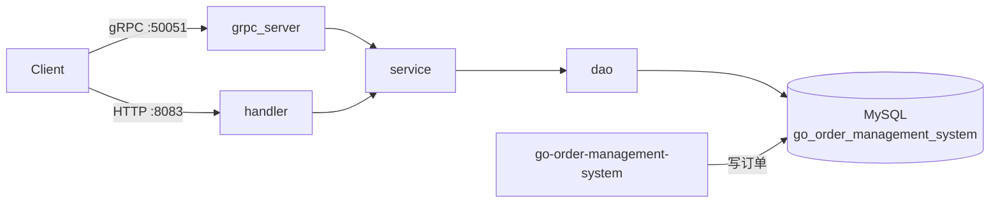

# go-grpc-demo

基于 **Go + Gin + GORM + MySQL + gRPC + protobuf** 的订单查询实验服务。  
定位为 [`go-order-management-system`](../go-order-management-system) 的旁路项目，验证用 gRPC 暴露订单读能力的拆分路径。

> 当前阶段以**只读订单查询**为主；真实下单、库存、幂等与状态机仍由主系统负责。

## 功能概览

| 能力 | 协议 | 状态 |
|------|------|------|
| 按 ID 查询订单 | HTTP `GET /api/v1/orders/:id` | 可用 |
| 按 ID 查询订单 | gRPC `order.OrderService/GetOrder` | 可用（响应字段仍可完善） |
| 健康检查 | HTTP `GET /ping` | 可用 |
| 创建订单 | HTTP / gRPC `CreateOrder` | 占位，不可用于真实下单 |

## 技术栈

- Go 1.25+
- HTTP：Gin
- RPC：gRPC + Protocol Buffers
- ORM：GORM + MySQL
- 配置：`config.yml` + 可选 `.env`（`MYSQL_PASSWORD` 等）

## 目录结构

```text
go-grpc-demo/
├── api/proto/order/     # .proto 与生成代码
├── cmd/                 # 进程入口（同时启动 gRPC + HTTP）
├── config/              # 配置加载
├── docs/                # 项目文档
├── internal/
│   ├── dao/             # 数据访问
│   ├── grpc_server/     # gRPC 适配层
│   ├── handler/         # HTTP 适配层
│   ├── model/           # 与主系统对齐的订单模型
│   ├── request/
│   ├── response/
│   └── service/         # 业务编排
├── pkg/db/              # MySQL / GORM 初始化
├── config.yml
├── Makefile
└── README.md
```

## 架构（简图）



更完整的分层与数据流见 [docs/architecture.md](docs/architecture.md)。

## 快速开始

### 1. 前置条件

- 本机 Go 环境
- 可访问的 MySQL，库名默认 `go_order_management_system`（与主系统一致）
- 库中 `orders` 表已有数据（可用主系统先下单）

### 2. 配置

编辑 `config.yml`：

```yaml
mysql:
  host: "127.0.0.1"
  user: "root"
  password: ""          # 为空时读环境变量 MYSQL_PASSWORD
  database: go_order_management_system
  port: 3306
server:
  port: 8083
```

可选：项目根目录 `.env`：

```env
MYSQL_PASSWORD=your_password
```

### 3. 启动

```bash
# 依赖
make tidy
# 或
go mod tidy

# 运行（工作目录为项目根，以便读到 config.yml）
make run
# 或
go run ./cmd
```

成功日志应类似：

```text
mysql connected: root@127.0.0.1:3306/go_order_management_system
gRPC Server is running on :50051...
```

| 入口 | 地址 |
|------|------|
| gRPC | `localhost:50051`（明文） |
| HTTP | `localhost:8083`（`server.port`） |

### 4. 调用示例

**HTTP 查询**

```bash
curl -s http://localhost:8083/ping
curl -s http://localhost:8083/api/v1/orders/1
```

**gRPC 查询**（需 [grpcurl](https://github.com/fullstorydev/grpcurl)；服务端未开 reflection，需带 proto）

```bash
grpcurl -plaintext ^
  -import-path ./api/proto ^
  -proto order/order.proto ^
  -d "{\"order_id\": 1}" ^
  localhost:50051 ^
  order.OrderService/GetOrder
```

Linux / macOS：

```bash
grpcurl -plaintext \
  -import-path ./api/proto \
  -proto order/order.proto \
  -d '{"order_id": 1}' \
  localhost:50051 \
  order.OrderService/GetOrder
```

## 与主系统的关系

| 项 | 约定 |
|----|------|
| 数据库 | 共享 `go_order_management_system`，本服务查询 `orders` |
| 包依赖 | **不** import 主系统 `internal/*` |
| 写路径 | 创建/支付/取消走主系统 HTTP API |
| Migration | 本项目不对主库做破坏性变更 / AutoMigrate |

## 文档索引

| 文档 | 说明 |
|------|------|
| [docs/project_aim.md](docs/project_aim.md) | 目标与非目标 |
| [docs/product_design.md](docs/product_design.md) | 产品边界与场景 |
| [docs/architecture.md](docs/architecture.md) | 架构与请求链路 |
| [docs/database_design.md](docs/database_design.md) | 订单相关表结构 |
| [docs/api_degin.md](docs/api_degin.md) | HTTP / gRPC 接口说明 |
| [docs/test_plan.md](docs/test_plan.md) | 联调与验收清单 |
| [docs/project_evolution.md](docs/project_evolution.md) | 迭代进度与里程碑 |

## 开发约定

```text
入口 grpc_server | handler  →  service  →  dao  →  MySQL
```

- proto 契约在 `api/proto/order/order.proto`；修改后需重新生成 `*.pb.go` / `*_grpc.pb.go`
- 金额单位为**分**（`total_amount_fen`）
- 订单状态：`1 pending` / `2 paid` / `3 finished` / `4 cancelled`

## Makefile

| 目标 | 说明 |
|------|------|
| `make help` | 查看目标 |
| `make run` | 本地启动 |
| `make tidy` | `go mod tidy` |

## 已知限制

- gRPC `GetOrder` 响应尚未填满全部业务字段（如完整 `user_id`、订单状态文案）
- 查不到订单时 gRPC 侧可能返回业务 `status=FAIL` 而非标准 `NotFound`
- 未开启 gRPC Server Reflection
- `CreateOrder` 仅为占位，请勿用于真实下单

## License

仅作学习与实验用途。
