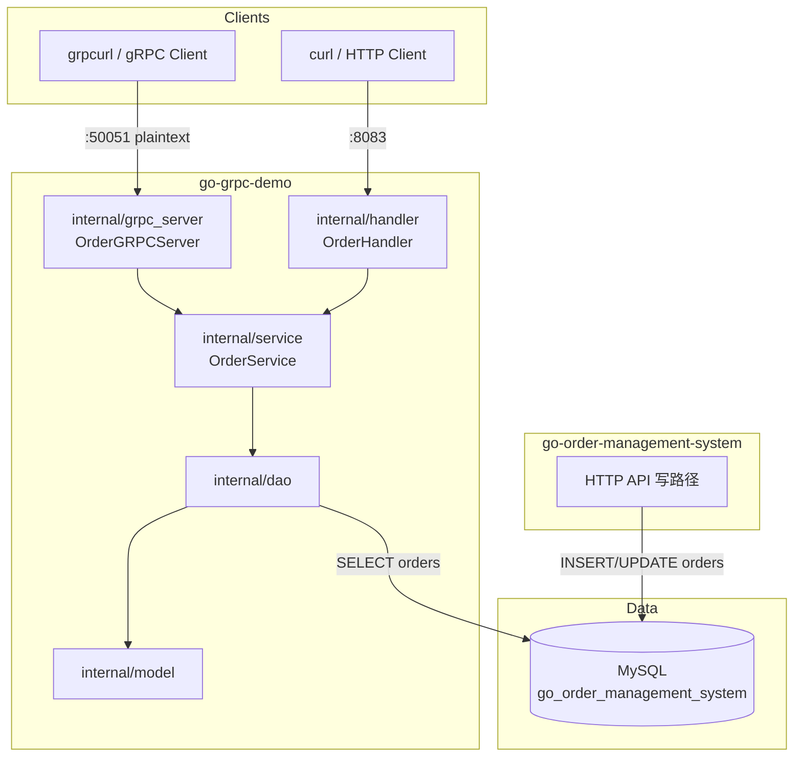
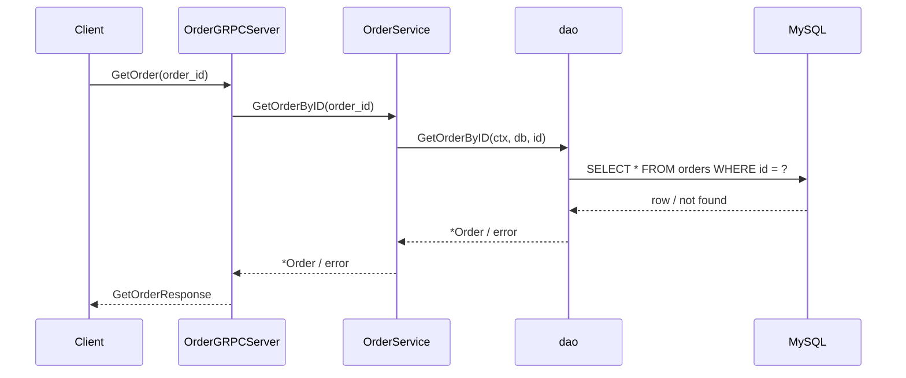
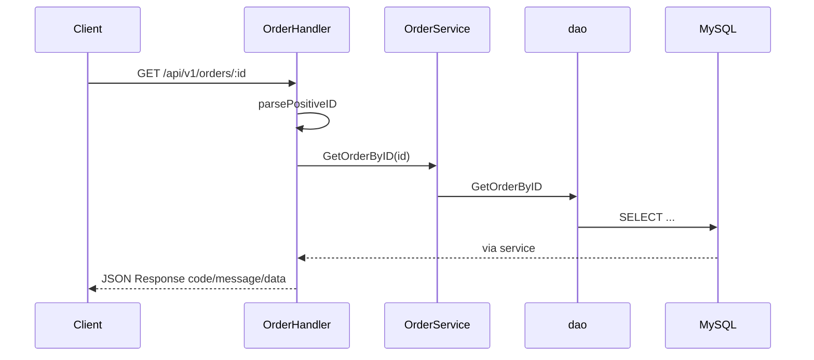
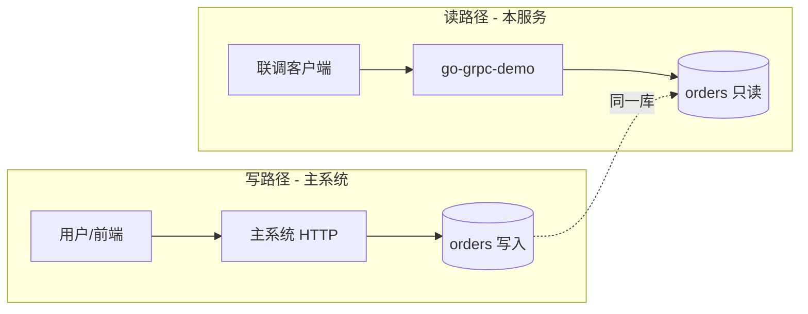

# 架构设计

## 1. 定位

`go-grpc-demo` 是订单主系统旁的**查询侧实验服务**：

- 用 **gRPC + protobuf** 暴露订单查询
- 用 **HTTP/Gin** 提供便于调试的只读接口
- **共享主系统 MySQL 读模型**，不复制主系统写事务与鉴权

主系统继续负责：注册登录、下单、库存、幂等、支付/完成/取消状态机。

## 2. 逻辑架构



## 3. 进程与端口

单进程双监听（`cmd/main.go`）：

| 协议 | 端口 | 注册内容 |
|------|------|----------|
| gRPC | `50051`（代码写死） | `order.OrderService` |
| HTTP | `8083`（`config.yml` → `server.port`） | Gin 路由 |

启动顺序概要：

1. `LoadEnv` / `LoadConfig`
2. `db.Init` 连接 MySQL
3. `NewOrderService` → 注入 `*gorm.DB`
4. goroutine 启动 gRPC Server
5. 主 goroutine 启动 Gin

## 4. 分层职责

| 层 | 包 | 职责 |
|----|-----|------|
| 契约 | `api/proto/order` | `.proto` 与生成的 pb / grpc 代码 |
| gRPC 适配 | `internal/grpc_server` | pb 入参校验映射、调 service、组 pb 响应 |
| HTTP 适配 | `internal/handler` | 解析路径/JSON、HTTP 状态码、统一 response |
| 业务 | `internal/service` | 编排，不直接暴露传输细节 |
| 数据 | `internal/dao` | GORM 查询/写入封装 |
| 模型 | `internal/model` | 表映射，对齐主系统 |
| 基础设施 | `config`, `pkg/db` | 配置与数据库连接 |

**依赖方向（只允许向内）：**

```text
cmd → grpc_server / handler → service → dao → model
                ↘______________↗
              api/proto（仅适配层依赖）
```

禁止：handler/grpc 直接写 SQL；dao 依赖 gin/grpc。

## 5. 请求链路

### 5.1 gRPC 查询订单



全名：`/order.OrderService/GetOrder`

### 5.2 HTTP 查询订单



### 5.3 创建（当前不完整）

`CreateOrder`（HTTP/gRPC）方法存在，但**未实现**主系统级业务（幂等、明细、库存）。架构上保留接口，验收时不以创建成功为准。

## 6. 与主系统集成边界



| 允许 | 不允许 |
|------|--------|
| 共享库只读 `orders`（及只读扩展） | import 主系统 `internal` |
| 独立 proto / 独立部署进程 | 本服务 AutoMigrate 改主表 |
| HTTP 辅助调试 | 在本服务重做完整交易链路 |

## 7. 配置与密钥

- 主配置：`config.yml`（host/user/database/port、HTTP port）
- 密码：优先 YAML；空则 `MYSQL_PASSWORD`
- 可选 `.env` 由 `godotenv` 加载；**勿提交真实密码**

## 8. 扩展方向（非当前实现）

1. 完善 `GetOrder` 字段与 gRPC `codes.NotFound`
2. Server Reflection，简化 `grpcurl`
3. `ListOrders`（user_id + 分页）
4. 若需强隔离：改为调主系统只读 HTTP/gRPC，而不是直连库
5. 调用图：`go-callvis`（本机需可用的 windows 二进制 + 可选 Graphviz）

## 9. 相关文档

- [product_design.md](product_design.md) — 场景与边界
- [database_design.md](database_design.md) — 表结构
- [api_degin.md](api_degin.md) — 接口明细
- [project_evolution.md](project_evolution.md) — 进度
