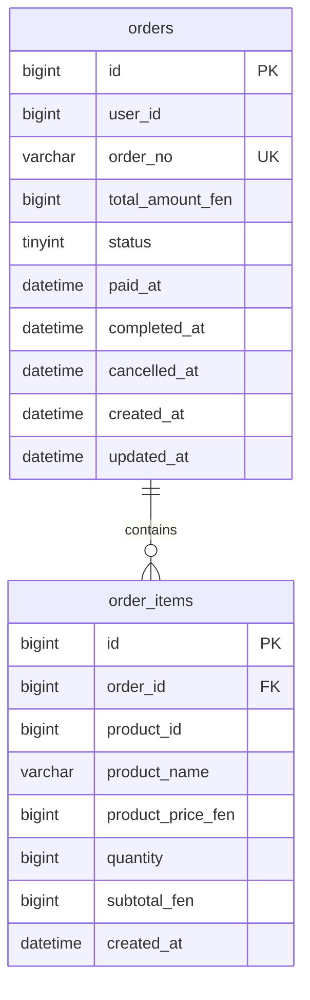

# 数据库设计

## 1. 说明

本服务**不维护独立业务库**，默认连接与主系统相同的 MySQL 库：

| 项 | 默认值 |
|----|--------|
| 库名 | `go_order_management_system` |
| 读表 | `orders`（查询已实现） |
| 映射表 | `order_items`（模型已对齐，查询链路暂未用到） |

表结构由主系统 migration 管理。本项目 **禁止** 对主库执行破坏性 migration / `AutoMigrate`。

金额单位统一为 **分**（`*_fen`）。

## 2. ER 关系（订单域）



## 3. 表：`orders`

对应模型：`internal/model/orders.go` → `TableName() = "orders"`

| 列 | 类型（逻辑） | 说明 |
|----|----------------|------|
| `id` | bigint PK AI | 订单主键 |
| `user_id` | bigint NOT NULL | 下单用户 |
| `order_no` | varchar(255) NOT NULL UK | 业务订单号 |
| `total_amount_fen` | bigint NOT NULL | 订单总金额（分） |
| `status` | tinyint NOT NULL | 见状态枚举 |
| `paid_at` | datetime NULL | 支付时间 |
| `completed_at` | datetime NULL | 完成时间 |
| `cancelled_at` | datetime NULL | 取消时间 |
| `created_at` | datetime NOT NULL | 创建时间 |
| `updated_at` | datetime NOT NULL | 更新时间 |

### 状态枚举

| 值 | 常量 | 含义 |
|----|------|------|
| 1 | `OrderStatusPending` | 待支付 |
| 2 | `OrderStatusPaid` | 已支付 |
| 3 | `OrderStatusFinished` | 已完成 |
| 4 | `OrderStatusCancelled` | 已取消 |

### 常用索引（与主系统一致的设计意图）

- `uk_orders_order_no`：`order_no` 唯一
- `idx_orders_user_id_created_at`：`(user_id, created_at)` 列表场景
- `idx_orders_status`：`status`

### 本服务查询 SQL 形态

```sql
SELECT * FROM orders WHERE id = ? LIMIT 1;
```

实现：`dao.GetOrderByID`。

## 4. 表：`order_items`

对应模型：`internal/model/order_items.go` → `TableName() = "order_items"`

| 列 | 类型（逻辑） | 说明 |
|----|----------------|------|
| `id` | bigint PK AI | 明细主键 |
| `order_id` | bigint NOT NULL | 所属订单 |
| `product_id` | bigint NOT NULL | 商品 ID |
| `product_name` | varchar(100) NOT NULL | 下单时商品名快照 |
| `product_price_fen` | bigint NOT NULL | 单价（分） |
| `quantity` | bigint NOT NULL | 数量 |
| `subtotal_fen` | bigint NOT NULL | 小计（分） |
| `created_at` | datetime NOT NULL | 创建时间 |

> 当前 `GetOrder` **不返回**明细行；后续可在 DAO 增加 `ListOrderItemsByOrderID` 并扩展 proto。

## 5. 本服务不直接依赖的表

主系统中还有商品、库存、用户、幂等键、超时 outbox 等表。  
本阶段订单查询**不读写**这些表；创建订单若未来要做，也应优先委托主系统 API，而不是在本库拼写事务。

## 6. 账号权限建议

演示可用 root；长期建议：

- 独立只读账号
- 仅 `SELECT` 于 `orders` / `order_items`（及确需的关联表）
- 密码只放环境变量 / Secret，不进仓库

## 7. 相关文档

- [architecture.md](architecture.md)
- [api_degin.md](api_degin.md)
- 主系统：`go-order-management-system/docs/table_design.md`（若存在）
